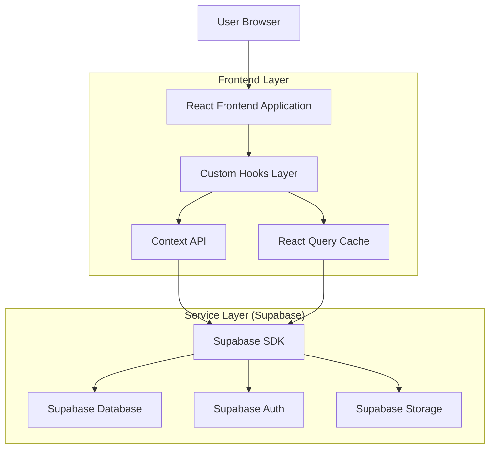
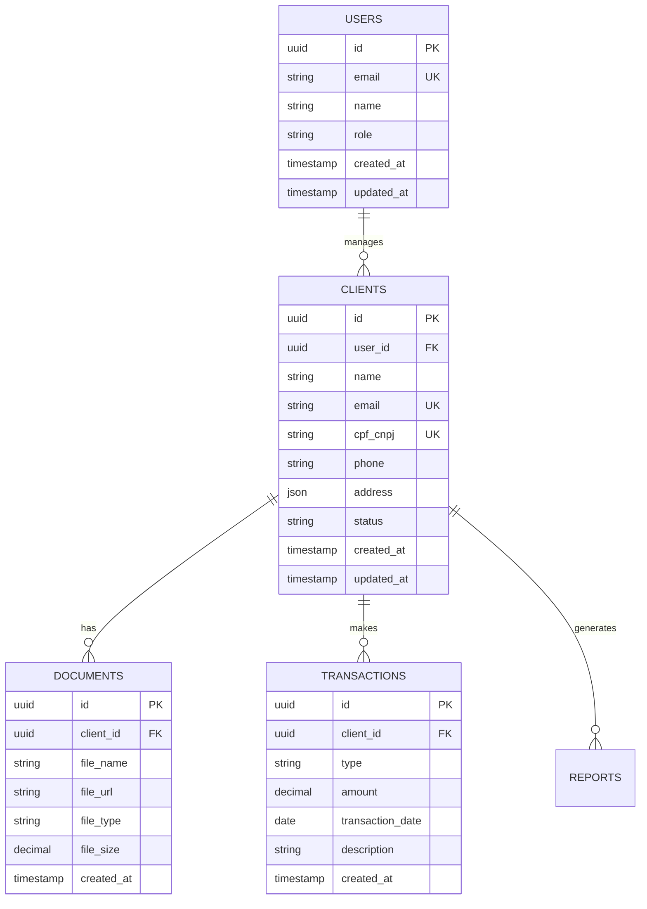

# Arquitetura Técnica - Sistema de Controle de Clientes de Contabilidade

## 1. Arquitetura Geral



## 2. Stack Tecnológica

- Frontend: React@18 + TypeScript + TailwindCSS@3 + Vite
- Backend: Supabase (PostgreSQL, Auth, Storage)
- Estado Global: Context API + React Query
- Hooks: Custom hooks para todas as operações de API
- Testes: Jest + React Testing Library

## 3. Definições de Rotas

| Rota | Propósito |
|------|-----------|
| / | Dashboard principal com visão geral dos clientes |
| /login | Página de autenticação do usuário |
| /clients | Listagem e gerenciamento de clientes |
| /clients/new | Formulário de cadastro de novo cliente |
| /clients/:id | Detalhes e edição de cliente específico |
| /import | Importação de planilhas de clientes |
| /documents | Gerenciamento de documentos fiscais |
| /reports | Relatórios e exportação de dados |
| /settings | Configurações da aplicação |

## 4. Hooks Customizados

### 4.1 useClients - Gerenciamento de Clientes

**Interface TypeScript:**
```typescript
interface UseClientsReturn {
  clients: Client[];
  loading: boolean;
  error: string | null;
  createClient: (data: CreateClientData) => Promise<void>;
  updateClient: (id: string, data: UpdateClientData) => Promise<void>;
  deleteClient: (id: string) => Promise<void>;
  searchClients: (query: string) => Promise<void>;
  invalidateCache: () => void;
}

interface Client {
  id: string;
  name: string;
  email: string;
  cpf_cnpj: string;
  phone: string;
  address: Address;
  status: 'active' | 'inactive';
  created_at: string;
  updated_at: string;
}
```

**Implementação:**
```typescript
export const useClients = (): UseClientsReturn => {
  const queryClient = useQueryClient();
  
  const { data: clients = [], isLoading, error } = useQuery({
    queryKey: ['clients'],
    queryFn: async () => {
      const { data, error } = await supabase
        .from('clients')
        .select('*')
        .order('name');
      
      if (error) throw new Error(error.message);
      return data;
    },
    staleTime: 5 * 60 * 1000, // 5 minutos
    cacheTime: 10 * 60 * 1000, // 10 minutos
  });

  const createClient = useMutation({
    mutationFn: async (clientData: CreateClientData) => {
      const { data, error } = await supabase
        .from('clients')
        .insert([clientData])
        .select()
        .single();
      
      if (error) throw new Error(error.message);
      return data;
    },
    onSuccess: () => {
      queryClient.invalidateQueries({ queryKey: ['clients'] });
      useToast.success('Cliente criado com sucesso!');
    },
    onError: (error) => {
      useToast.error('Erro ao criar cliente: ' + error.message);
    }
  });

  return {
    clients,
    loading: isLoading,
    error: error?.message || null,
    createClient: createClient.mutateAsync,
    // ... outras funções
  };
};
```

### 4.2 useAuth - Gerenciamento de Autenticação

**Interface TypeScript:**
```typescript
interface UseAuthReturn {
  user: User | null;
  loading: boolean;
  error: string | null;
  signIn: (email: string, password: string) => Promise<void>;
  signOut: () => Promise<void>;
  signUp: (email: string, password: string, metadata: UserMetadata) => Promise<void>;
  resetPassword: (email: string) => Promise<void>;
  updateProfile: (data: UpdateProfileData) => Promise<void>;
}
```

### 4.3 useImport - Importação de Planilhas

**Interface TypeScript:**
```typescript
interface UseImportReturn {
  importing: boolean;
  progress: number;
  error: string | null;
  importClients: (file: File) => Promise<void>;
  validateData: (data: any[]) => ValidationResult;
  previewData: ImportPreview[];
}
```

### 4.4 useExport - Exportação de Dados

**Interface TypeScript:**
```typescript
interface UseExportReturn {
  exporting: boolean;
  error: string | null;
  exportToExcel: (filters?: ExportFilters) => Promise<void>;
  exportToPDF: (type: ReportType, filters?: ExportFilters) => Promise<void>;
  generateReport: (config: ReportConfig) => Promise<Blob>;
}
```

### 4.5 useDocuments - Gerenciamento de Documentos

**Interface TypeScript:**
```typescript
interface UseDocumentsReturn {
  documents: Document[];
  loading: boolean;
  error: string | null;
  uploadDocument: (file: File, clientId: string) => Promise<void>;
  deleteDocument: (id: string) => Promise<void>;
  downloadDocument: (id: string) => Promise<void>;
  listDocuments: (clientId?: string) => Promise<void>;
}
```

### 4.6 useToast - Notificações

**Interface TypeScript:**
```typescript
interface UseToastReturn {
  show: (message: string, type?: ToastType) => void;
  success: (message: string) => void;
  error: (message: string) => void;
  warning: (message: string) => void;
  info: (message: string) => void;
}

type ToastType = 'success' | 'error' | 'warning' | 'info';
```

## 5. Context API

### 5.1 AuthContext - Estado Global de Autenticação

```typescript
interface AuthContextType {
  user: User | null;
  isAuthenticated: boolean;
  loading: boolean;
  signIn: (email: string, password: string) => Promise<void>;
  signOut: () => Promise<void>;
}

export const AuthContext = createContext<AuthContextType | undefined>(undefined);

export const AuthProvider: React.FC<{ children: ReactNode }> = ({ children }) => {
  const [user, setUser] = useState<User | null>(null);
  const [loading, setLoading] = useState(true);

  useEffect(() => {
    // Verificar sessão atual
    const checkSession = async () => {
      try {
        const { data: { session } } = await supabase.auth.getSession();
        setUser(session?.user ?? null);
      } catch (error) {
        console.error('Erro ao verificar sessão:', error);
      } finally {
        setLoading(false);
      }
    };

    checkSession();

    // Ouvir mudanças de autenticação
    const { data: { subscription } } = supabase.auth.onAuthStateChange(
      (event, session) => {
        setUser(session?.user ?? null);
      }
    );

    return () => subscription.unsubscribe();
  }, []);

  const value = {
    user,
    isAuthenticated: !!user,
    loading,
    signIn,
    signOut
  };

  return (
    <AuthContext.Provider value={value}>
      {children}
    </AuthContext.Provider>
  );
};
```

### 5.2 ClientContext - Gerenciamento de Estado de Clientes

```typescript
interface ClientContextType {
  selectedClient: Client | null;
  filters: ClientFilters;
  sortBy: SortOption;
  setSelectedClient: (client: Client | null) => void;
  setFilters: (filters: ClientFilters) => void;
  setSortBy: (sort: SortOption) => void;
}

export const ClientContext = createContext<ClientContextType | undefined>(undefined);
```

### 5.3 AppContext - Configurações Globais

```typescript
interface AppContextType {
  theme: 'light' | 'dark';
  language: string;
  itemsPerPage: number;
  setTheme: (theme: 'light' | 'dark') => void;
  setLanguage: (language: string) => void;
  setItemsPerPage: (items: number) => void;
}

export const AppContext = createContext<AppContextType | undefined>(undefined);
```

## 6. Padrões de Uso e Boas Práticas

### 6.1 Regras de Uso de Hooks

1. **Componentes nunca devem fazer fetch direto da API**
   - Sempre usar hooks customizados
   - Manter separação entre lógica de negócio e UI

2. **Estrutura de Componentes**
   ```typescript
   // ✅ Correto: Usando hook customizado
   export const ClientList: React.FC = () => {
     const { clients, loading, error, searchClients } = useClients();
     
     if (loading) return <LoadingSpinner />;
     if (error) return <ErrorMessage message={error} />;
     
     return (
       <div>
         {clients.map(client => (
           <ClientCard key={client.id} client={client} />
         ))}
       </div>
     );
   };
   ```

3. **Tratamento de Erros Centralizado**
   - Todos os hooks devem tratar erros de forma consistente
   - Usar useToast para notificações
   - Implementar retry automático quando apropriado

### 6.2 Cache e Invalidação

```typescript
// Invalidação de cache após mutação
const createClient = useMutation({
  mutationFn: createClientAPI,
  onSuccess: () => {
    // Invalidar queries relacionadas
    queryClient.invalidateQueries({ queryKey: ['clients'] });
    queryClient.invalidateQueries({ queryKey: ['client-stats'] });
    
    // Mostrar notificação de sucesso
    useToast.success('Cliente criado com sucesso!');
  }
});
```

### 6.3 Testes Unitários para Hooks

```typescript
describe('useClients', () => {
  it('should fetch clients successfully', async () => {
    const mockClients = [{ id: '1', name: 'Client 1' }];
    
    (supabase.from as jest.Mock).mockReturnValue({
      select: jest.fn().mockReturnValue({
        order: jest.fn().mockResolvedValue({ data: mockClients, error: null })
      })
    });
    
    const { result } = renderHook(() => useClients());
    
    await waitFor(() => {
      expect(result.current.clients).toEqual(mockClients);
      expect(result.current.loading).toBe(false);
    });
  });

  it('should handle errors correctly', async () => {
    const mockError = new Error('Network error');
    
    (supabase.from as jest.Mock).mockReturnValue({
      select: jest.fn().mockReturnValue({
        order: jest.fn().mockResolvedValue({ data: null, error: mockError })
      })
    });
    
    const { result } = renderHook(() => useClients());
    
    await waitFor(() => {
      expect(result.current.error).toBe('Network error');
      expect(result.current.loading).toBe(false);
    });
  });
});
```

## 7. Modelo de Dados

### 7.1 Diagrama ER



### 7.2 Definições SQL

```sql
-- Tabela de usuários
CREATE TABLE users (
    id UUID PRIMARY KEY DEFAULT gen_random_uuid(),
    email VARCHAR(255) UNIQUE NOT NULL,
    name VARCHAR(255) NOT NULL,
    role VARCHAR(50) DEFAULT 'user' CHECK (role IN ('admin', 'user')),
    created_at TIMESTAMP WITH TIME ZONE DEFAULT NOW(),
    updated_at TIMESTAMP WITH TIME ZONE DEFAULT NOW()
);

-- Tabela de clientes
CREATE TABLE clients (
    id UUID PRIMARY KEY DEFAULT gen_random_uuid(),
    user_id UUID REFERENCES users(id) ON DELETE CASCADE,
    name VARCHAR(255) NOT NULL,
    email VARCHAR(255) UNIQUE NOT NULL,
    cpf_cnpj VARCHAR(20) UNIQUE NOT NULL,
    phone VARCHAR(20),
    address JSONB,
    status VARCHAR(20) DEFAULT 'active' CHECK (status IN ('active', 'inactive')),
    created_at TIMESTAMP WITH TIME ZONE DEFAULT NOW(),
    updated_at TIMESTAMP WITH TIME ZONE DEFAULT NOW()
);

-- Tabela de documentos
CREATE TABLE documents (
    id UUID PRIMARY KEY DEFAULT gen_random_uuid(),
    client_id UUID REFERENCES clients(id) ON DELETE CASCADE,
    file_name VARCHAR(255) NOT NULL,
    file_url TEXT NOT NULL,
    file_type VARCHAR(50) NOT NULL,
    file_size DECIMAL(10,2),
    created_at TIMESTAMP WITH TIME ZONE DEFAULT NOW()
);

-- Índices para performance
CREATE INDEX idx_clients_user_id ON clients(user_id);
CREATE INDEX idx_clients_status ON clients(status);
CREATE INDEX idx_clients_created_at ON clients(created_at DESC);
CREATE INDEX idx_documents_client_id ON documents(client_id);

-- Permissões Supabase
GRANT SELECT ON users TO anon;
GRANT ALL PRIVILEGES ON users TO authenticated;
GRANT SELECT ON clients TO anon;
GRANT ALL PRIVILEGES ON clients TO authenticated;
GRANT SELECT ON documents TO anon;
GRANT ALL PRIVILEGES ON documents TO authenticated;
```

## 8. Segurança e Performance

### 8.1 Segurança
- Todas as operações de banco passam por RLS (Row Level Security) do Supabase
- Validação de dados nos hooks antes de enviar para API
- Sanitização de inputs em todos os formulários
- Rate limiting implementado no backend

### 8.2 Performance
- React Query para cache inteligente
- Paginação em todas as listagens
- Lazy loading de componentes pesados
- Compressão de imagens antes do upload
- Índices otimizados no banco de dados